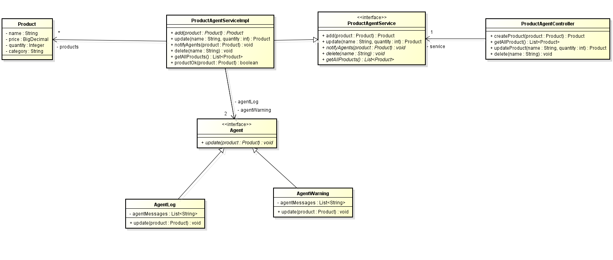
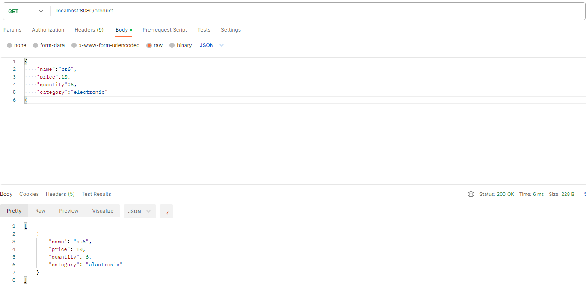
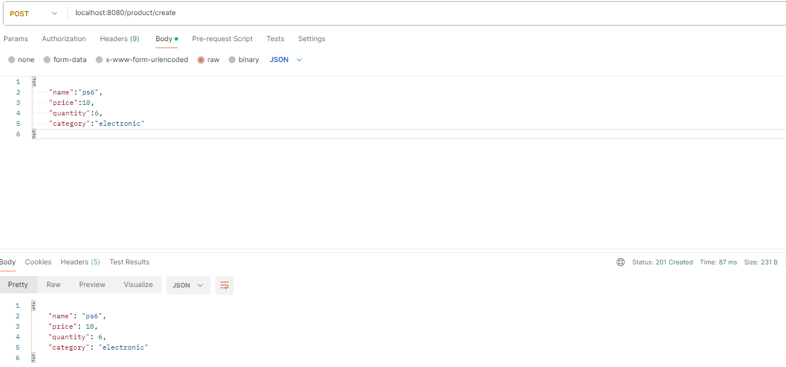
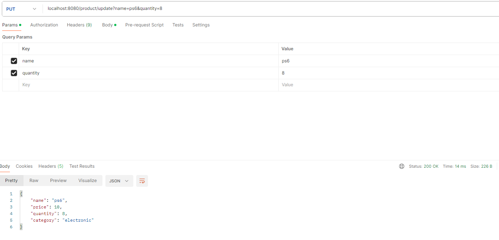
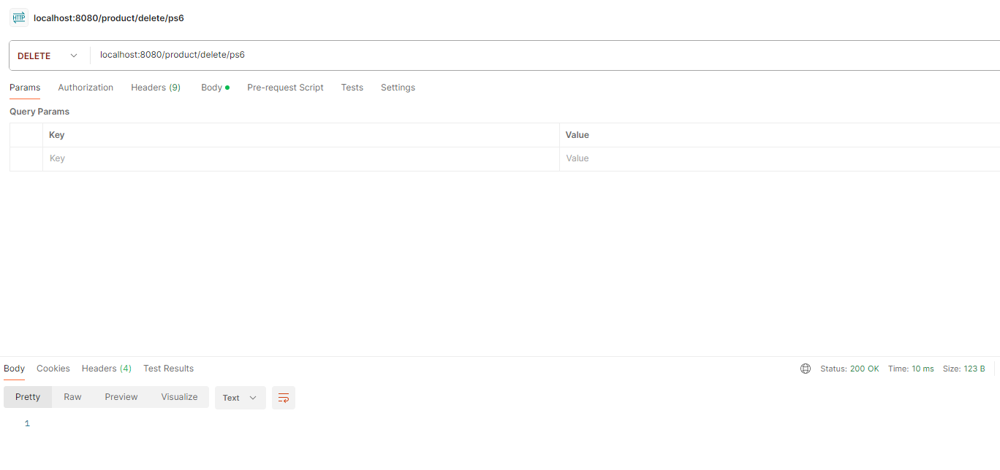
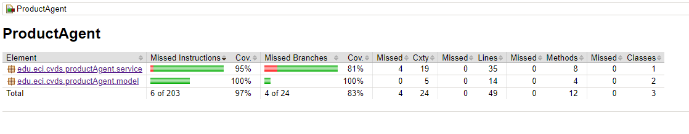

# Parcial primer corte

## Patrón de diseño seleccionado

El patrón de diseño seleccionado para implementar en este caso es Observer.
Observer es un patrón de diseño que sirve para actualizar información de una clase
que es vital para su funcionamiento, pero esta información se encuentra en otra clase.
Entonces, con Observer es posible que cada vez que se actualiza la clase con la información
esta llame a las clases que necesitan estos datos que se actualizaron.

En este caso es Agent es quien necesita la informacion de los productos que estan en 
ProductAgentServiceImpl, entonces cada vez que se actualiza el stock de un producto
se notifica a los agentes de este cambio.

## Documentación

### Peticiones a la API. La url globlas es localhost:8080/product

### La api ofrece 4 path:

### getAllProduct
#### Path: es la global
#### Método http GET
getAllProduct sirve para obtener todos los productos que han sido guardados en 
la aplicación

Ejemplo de la petición:

### createProduct
### Path: /create
### Método http POST
### Body recibe {"name":"string", "price":float, "quantity":integer, "category":"string"} que es el producto a añadir.

Ejemplo de la petición con un flujo normal:

Si falla algo dentro de la creación por la validación lo que se muestra en la respuesta de la peticion es null.

### updateProduct
### Path: /update
### Método http PUT
### Recibe dos parametros en el path name y quantity, el name es el producto a modificar su cantidad de stock.

Ejemplo de la petición de un flujo normal:

### deleteProduct
### Path: /delete
### Método http DELETE
### Recibe una variable en el path la cual es el nombre del producto a eliminar.

Ejemplo de la petición:

Si falla algo dentro de la creación por la validación lo que se muestra en la respuesta de la peticion es null.

## Cobertura con jacoco

